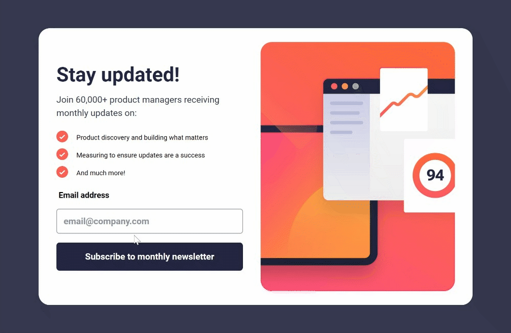

# Newsletter Sign-up Form

## Description
This project contains a newsletter sign-up form with a success message, designed for Frontend Mentor. The form allows users to subscribe to a monthly newsletter and displays a success message upon successful subscription.

## Project Structure
- **index.html**: The main HTML file containing the structure of the sign-up form and success message.
- **css/styles.css**: Compiled CSS file where all styles from `styles.scss` are loaded.
- **styles.scss**: SCSS file containing styles written using the SCSS preprocessor.
- **jquery.js**: JavaScript library for DOM manipulation.
- **script.js**: Custom JavaScript code for form validation and handling success message.

## Usage
1. Open `index.html` in a web browser.
2. Fill in your email address in the input field.
3. Click the "Subscribe to monthly newsletter" button.
4. Upon successful subscription, a confirmation message will be displayed with further instructions.

## Styles
The project uses a responsive design with different styles for mobile and desktop views. It includes custom styles for the form, success message, and responsive layout adjustments. Styles are initially written in `styles.scss` and compiled into the `css/styles.css` file.

## Dependencies
- [Roboto Font](https://fonts.googleapis.com/css2?family=Roboto:wght@400;700&display=swap)
- jQuery Library

